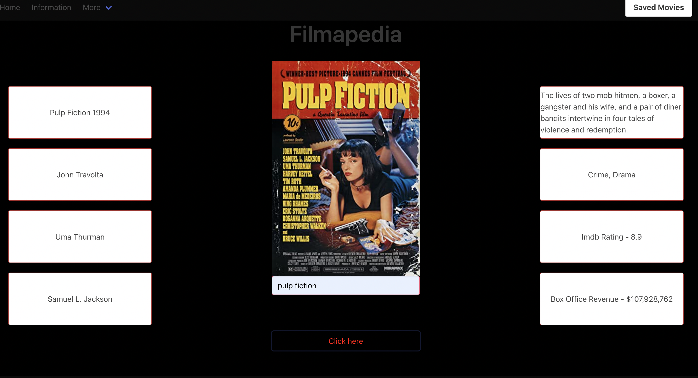

# Filmapedia

## Description
A web app that showcases information about a film; it will display information such as release date, actors, movie poster and more.
The web app demonstrates the ability to use a Javascript GET method to retrieve information using application programming interface (API).
Once the information about the film is displayed, the web app will have a button that takes the user to a wikipedia page using a second API.
The website also demonstrates the usage of a CSS framework called bulma to utilize the styling of the web application 

Deployed website: https://lacko3006.github.io/Filmapedia/

Github repo: https://github.com/Lacko3006/Filmapedia

## Usage

When the user types in a movie name into the input and then press's the click hear button, a poster in the middle of the screen will display as well as various cards showcasing other information about the movie. 

Just above the "click hear" button is another button that uses the api to take the user to a wikipedia page about that film.

## License
Please refer to the LICENSE in the repo.
